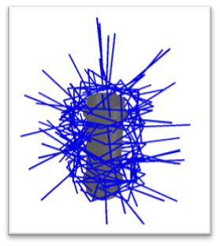
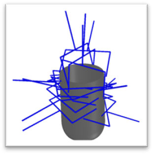
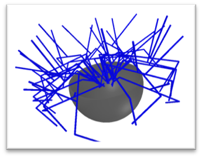

## Overview

  

## Installation

## Usage

## Parameters

Description of available parameters:

| Argument / Flag                  | Description                                                                                                         | Type   | Default      |
|----------------------------------|---------------------------------------------------------------------------------------------------------------------|--------|--------------|
| `-np`, `--num_points`            | Number of points to sample on the mesh.                                                                             | int    | 10_000       |
| `-mg`, `--max_grasps`            | Maximum number of grasps to sample.                                                                                 | int    | 2500         |
| `-mr`, `--max_rotations`         | Maximum number of rotations per grasp.                                                                              | int    | 4            |
| `-f`, `--friction`               | Friction coefficient.                                                                                               | float  | 0.4          |
| `-vs`, `--visualize_single`      | Visualize a single result (flag).                                                                                   | bool   | False        |
| `-va`, `--visualize_all`         | Visualize all results (flag).                                                                                       | bool   | False        |
| `-s`, `--scenes_path_yml`        | Path to the YAML configuration of scenes.                                                                           | str    | scenes/      |
| `-i`, `--indices`                | Index range or specific indices of scenes to load, e.g., `'0-5'` for a range or `'1,3,5'` for specific indices.     | str    | ""           |

An example of changing the parameters:
```
python3 main.py -np 20000 -mg 5000 -f 0.35 -s path/to/scenes/ -i "0-9" --visualize_single
```

## Parameter Tuning Tips

1. **Number of points (`num_points`)**: Higher values yield a denser point cloud and more accurate results, but increase runtime.
2. **`max_grasps`** and **`max_rotations`**: Adjust to control the variety and number of generated grasps.
3. **`friction`**: Change the coefficient to simulate different physical scenarios.
4. **Visualization:** Use `--visualize_single` or `--visualize_all` to display results graphically.
5. **Scene selection (`indices`)**: Use `--indices` to select specific scenes for processing.