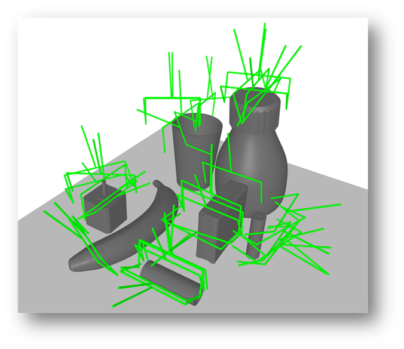

## Overview



## Installation

### 1. Clone the Repository

```bash
git pull https://github.com/sersandre/OptiSim.git

cd grasp_sampler
```

### 2. Create conda environment (Python 3.11 only)

```bash
conda create -n <myenv> python=3.11
conda activate <myenv>
```

### 3. Install Python dependencies

````
pip install -r requirements.txt
````


## Usage

## Parameters

Description of available parameters:

| Argument / Flag             | Description                                                                                                                                                             | Type  | Default                    |
|----------------------------|-------------------------------------------------------------------------------------------------------------------------------------------------------------------------|-------|----------------------------|
| `-np`, `--num_points`      | Number of points to sample on the mesh.                                                                                                                                 | int   | 10_000                     |
| `-mg`, `--max_grasps`      | Maximum number of grasps to sample.                                                                                                                                     | int   | 2500                       |
| `-mr`, `--max_rotations`   | Maximum number of rotations per grasp.                                                                                                                                  | int   | 4                          |
| `-f`, `--friction`         | Friction coefficient.                                                                                                                                                   | float | 0.4                        |
| `--visualize_single`       | Visualize a single result. Recommended only when processing a single scene; using this with multiple processes may open many windows.                                   | bool  | False                      |
| `-va`, `--visualize_all`   | Visualize all results. Recommended only when processing a single scene; using this with multiple processes may open many windows.                                       | bool  | False                      |
| `-s`, `--scenes_path_yml`  | Path to the YAML configuration of scenes.                                                                                                                               | str   | `scenes/`                  |
| `-i`, `--indices`          | Index range or specific indices of scenes to load, e.g., `'0-5'` for a range or `'1,3,5'` for specific indices.                                                        | str   | `""`                       |
| `-nw`, `--num_workers`     | Number of worker processes (default: number of CPU cores).                                                                                                              | int   | Number of CPU cores (`os.cpu_count()`) |

An example of changing the parameters:
```
python3 main.py -np 20000 -mg 5000 -f 0.35 -s path/to/scenes/ -i "0-9" --visualize_single -nw 10
```

## Parameter Tuning Tips

1. **Number of points (`num_points`)**: Higher values yield a denser point cloud and more accurate results, but increase runtime.
2. **`max_grasps`** and **`max_rotations`**: Adjust to control the variety and number of generated grasps.
3. **`friction`**: 
