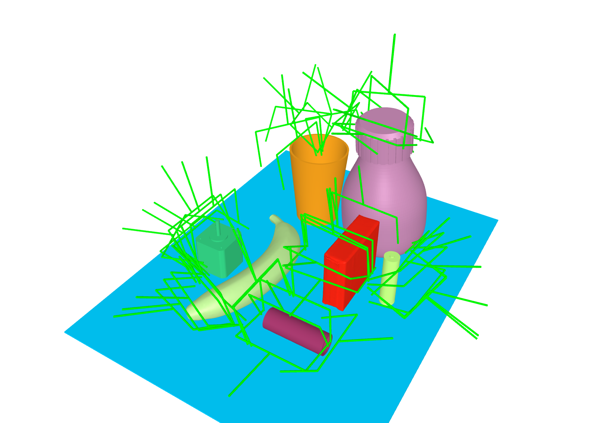

# GraspIt - Grasp Sampler

Antipodal grasp sampling for tabletop scenes with parallel processing support.

## Overview

The grasp sampler generates collision-free antipodal grasp poses for objects placed on a table surface. It uses surface point sampling, ray-based contact point detection, and friction cone validation to produce physically plausible two-finger grasps.



### Key Features

- **Antipodal grasp sampling** based on friction cone constraints
- **Collision checking** against all objects in the scene
- **Parallel processing** across multiple scenes using multiprocessing

## Algorithm

1. Sample `num_points` points on the object surface.
2. For each candidate point, cast a ray along the inward normal to find a second contact point.
3. Validate the antipodal condition using the friction coefficient.
4. Test `max_rotations` orientations around the connecting line.
5. Check for collisions between the gripper and the scene.
6. Store valid grasp poses (original + 180° flipped) as 4×4 transformation matrices.

## Gripper

The sampler uses the **original Franka Hand Gripper mesh** (`franka_gripper_conv.stl`) for collision checking during grasp sampling. This ensures that the generated grasps are directly compatible with the Franka Emika Panda robot used in simulation to evaluate and execute the grasps.

Additionally, a **custom gripper** model is supported. It is a simplified representation built from cylinders that approximates the gripper geometry. This custom model is primarily intended for **visualization purposes**, as it renders faster and provides a clearer visual representation of grasp poses in the scene viewer.

| Gripper Mode | Use Case                              | Model                          |
|--------------|---------------------------------------|--------------------------------|
| Original     | Collision checking during sampling    | `gripper/franka_gripper_conv.stl` |
| Custom       | Visualization of grasp results        | Cylinder-based approximation   |
## Installation

### 1. Clone the Repository

```bash
git clone https://github.com/KochPJ/GraspIt.git
cd grasp_sampler
```

### 2. Create Conda Environment (Python 3.11 Only)

```bash
conda create -n <myenv> python=3.11
conda activate <myenv>
```

### 3. Install Python Dependencies

```bash
pip install -r requirements.txt
```

## Scenes Directory Structure

The `scenes/` directory must follow this structure. Each scene resides in its own subdirectory containing a `scene.yml` configuration file. The `grasps.hdf5` file is generated automatically by the sampler.

```
scenes/
├── scene_001/
│   ├── scene.yml        # Scene configuration (required)
│   └── grasps.hdf5      # Grasp output (generated by sampler)
├── scene_002/
│   ├── scene.yml
│   └── grasps.hdf5
├── scene_003/
│   ├── scene.yml
│   └── grasps.hdf5
└── ...
```

## Scene Configuration

Each scene is defined by a YAML file (`scene.yml`) with the following structure:

```yaml
table:
  name: "TableModel"
  file_path: "path/to/table_mesh"
  position: [0.0, 0.0, 0.0]
  orientation: [1.0, 0.0, 0.0, 0.0]  # quaternion (w, x, y, z)

objects:
  - name: "mug"
    file_path: "path/to/mug_mesh"
    position: [0.1, 0.2, 0.75]
    orientation: [1.0, 0.0, 0.0, 0.0]
    scale: [0.001, 0.001, 0.001]

  - name: "bowl"
    file_path: "path/to/bowl_mesh"
    position: [-0.1, 0.15, 0.75]
    orientation: [0.7071, 0.0, 0.0, 0.7071]
    scale: [0.001, 0.001, 0.001]
```

| Field         | Description                                              |
|---------------|----------------------------------------------------------|
| `name`        | Identifier for the object (used as HDF5 dataset key).   |
| `file_path`   | Path to the mesh file (without or with extension).       |
| `position`    | Translation as `[x, y, z]` in meters.                   |
| `orientation` | Rotation as quaternion `[w, x, y, z]`.                   |
| `scale`       | Scale factors `[x, y, z]` (optional).   |

Supported mesh formats: `.obj`, `.stl`, `.usd` (USD is automatically converted to OBJ).

## Usage

### Basic Usage (Single Scene)

```bash
python main.py -s scenes/scene_001/scene.yml
```

### Process All Scenes in a Directory

```bash
python main.py -s scenes/
```

### Process a Range of Scenes

```bash
python main.py -s scenes/ -i "0-9"
```

### Process Specific Scenes

```bash
python main.py -s scenes/ -i "1,3,7"
```

### Full Example with Custom Parameters

```bash
python main.py -np 20000 -mg 5000 -mr 8 -f 0.35 -s path/to/scenes/ -i "0-9" -nw 10
```

### Visualization (Single Scene Only)

```bash
python main.py -s scenes/scene_001/scene.yml --visualize_single
python main.py -s scenes/scene_001/scene.yml --visualize_all
```

> **Note:** Visualization flags are recommended only for single-scene processing. Using them with multiple workers may open many windows simultaneously.

## Parameters

| Argument / Flag | Description | Type | Default |
|---------------|-------------|------|---------|
| `-np`, `--num_points` | Number of points to sample on the mesh. | int | `10000` |
| `-mg`, `--max_grasps` | Maximum number of grasps to sample. | int | `2500` |
| `-mr`, `--max_rotations` | Maximum number of rotations per grasp. | int | `4` |
| `-f`, `--friction` | Friction coefficient. | float | `0.4` |
| `-vs`, `--visualize_single` | Visualize a single result. | flag | `False` |
| `-va`, `--visualize_all` | Visualize all results. | flag | `False` |
| `-s`, `--scenes_path_yml` | Path to the YAML configuration of scenes. | str | `scenes/` |
| `-i`, `--indices` | Index range or specific indices of scenes, e.g., `'0-5'` or `'1,3,5'`. | str | all scenes |
| `-nw`, `--num_workers` | Number of worker processes. | int | `os.cpu_count()` |

## Parameter Tuning Tips

### Number of Points (`num_points`)

Higher values yield a denser point cloud and more accurate contact points, but increase runtime. Start with `10,000` and increase if grasp quality is insufficient.

### `max_grasps` and `max_rotations`

Together they control the total number of candidates evaluated per object (`max_grasps × max_rotations`). Increase `max_rotations` for objects with complex geometry where orientation matters.

### Friction (`friction`)

Controls the strictness of the antipodal condition:

- Higher values (e.g., `0.6–0.8`) → more permissive, more grasps accepted.
- Lower values (e.g., `0.2–0.3`) → stricter, fewer but more robust grasps.
- Typical rubber-on-plastic friction: approximately `0.4–0.5`.

### `num_workers`

Set to the number of available CPU cores for maximum throughput. Reduce if memory is a constraint (each worker loads a full scene into memory).

### General Guideline

`num_points` must always be **greater than or equal to** `max_grasps`.

## Output

For each scene, the sampler generates:

- `grasps.hdf5` in the scene directory, containing one dataset per object.
- Each dataset has shape `(N, 2, 4, 4)`:
  - `N` = number of valid grasps found
  - `2` = original pose + 180° flipped pose
  - `4×4` = homogeneous transformation matrix (rotation + TCP position)

### Reading and Visualizing the Output

```python
import h5py
import numpy as np
import random
from gripper import Gripper
from scene import Scene
from utlis import load_yaml

scene = Scene.from_dict(load_yaml(scene_path))
gripper = Gripper(custom=True)

with h5py.File(scene.grasp_path, "r") as f:
    for idx, obj in enumerate(scene.objects):
        grasps = f[obj.name][()]
        
        grasp_list = []
        for g in grasps:
            grasp_list.extend(g)  # original + flipped

        for t in grasp_list[:10]:
            gripper.transform(t)

            approach = t[:3, 2]
            offset = np.eye(4)
            offset[:3, 3] = np.transpose([(-gripper.gripper_total_length+gripper.marker_radius) * approach])
            gripper.transform(offset)

            scene.add(gripper.marker.copy(), idx)

            # reset
            gripper.transform(np.linalg.inv(offset))

scene.show()
```

## Troubleshooting

| Problem | Solution |
|----------|----------|
| FileNotFoundError for mesh | Check `file_path` in the YAML and ensure the mesh file exists as `.obj`, `.stl`, or `.usd`. |
| Very few grasps found | Increase `num_points`, increase `friction`, or increase `max_rotations`. |
| Out of memory | Reduce `num_workers` or `num_points`. |
| Script hangs on exit | Press `Ctrl+C` — the script kills the entire process group via `SIGKILL`. |
| Visualization windows freeze | Use visualization flags only with a single scene (`-nw 1`). |

## References

Ferrari, C. & Canny, J. (1992). *Planning Optimal Grasps*. IEEE International Conference on Robotics and Automation. DOI.


## Sources

- https://github.com/KochPJ/GraspIt.git
