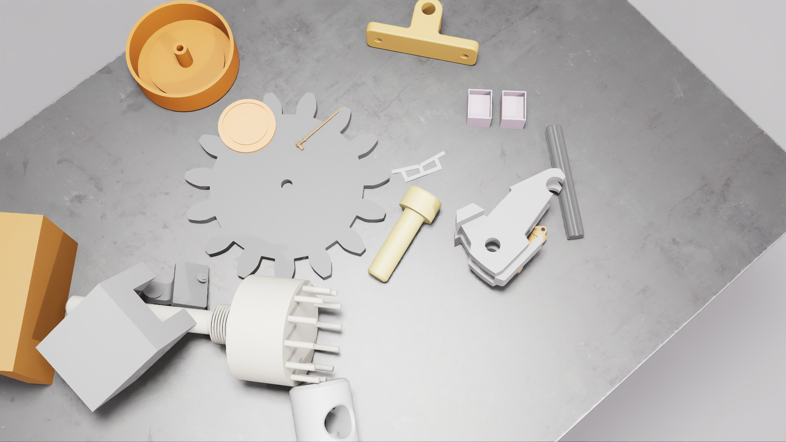

## Overview
 
## Installation
The scene sampler currently runs on Isaac-Sim 2023.1.0-hotfix.1. While this is no longer a release version of Isaac-Sim, docker deployment is still possible. Docker installation of Isaac-Sim requires the [NVIDIA Docker Toolkit](https://docs.nvidia.com/datacenter/cloud-native/container-toolkit/latest/install-guide.html). 

````
git pull https://github.com/sersandre/OptiSim.git
docker pull nvcr.io/nvidia/isaac-sim:2023.1.0-hotfix.1

cd scene_sampler
docker build -t scene_sampler .
````
Though release versions of the Isaac-Sim docker require a GPU driver version of 535.129.03, all tests and deployments were done with CUDA 12.2 and driver version 535.54.03. For further details on installing newer versions of the Isaac-Sim docker, please refer to the [documentation](https://docs.isaacsim.omniverse.nvidia.com/latest/installation/install_container.html)

The scene sampler requires [python](https://www.python.org/downloads/) >= 3.10.12 and [pip](https://pip.pypa.io/en/stable/installation/) >=22.0.2

It is recommended to run the scene sampler in a virtual environment. All dependencies are listed in requirements.txt:
````
python3 -m venv optisim
source optisim/bin/activate
pip install -r requirements.txt
````
## Usage
Prior to running the scene sampler assets (and optionally textures) must be provided in .usd format. The filepath can be specified during execution of the scene sampler. The directory for assets and textures should be structured like:
````
/assets_root_path
└── /assets
    ├── /object_name
    │   ├── object_name.usd
    ...
└── /textures
    ├── texture1.jpg
    ...
````
Not specifying texture files is not a problem for the Scene Sampler, but it does mean that the object textures are not randomized during data generation. The *configs/abc_objects.yaml* provides a example config for one slice of the [ABC-Dataset](https://deep-geometry.github.io/abc-dataset/). Conversion from .obj to .usd file format was done using Isaac-Sims [Asset Converter](https://docs.omniverse.nvidia.com/extensions/latest/ext_asset-converter.html). 

After data generation, the dataset will be in the following format:
````
/dataset
└── /scene_*
    ├── /frame_*
    │   ├── camera_params_*.json
    │   ├── depth.png
    │   ├── rgb_*.png
    │   ├── semantic_segmentation_*.png
    │   └── semantic_segmentation_labels_*.json
    ...
````
*main.py* is the standalone startup for the scene sampler. The sampler queries the number of GPUs for usage, the number of generated scenes as well as a batch size for each running thread. The batch size can be used to balance loads when using multiple GPUs, however, running the scene sampler in the default settings without dramatically increasing the number of objects rendered per scene will keep GPU-usage at around 4-5Gb of VRAM.

Omniverse discontinued usage of the Omniverse launcher in 2025. Since Isaac-Sim requires a connection to the [Omiverse Nucleus Server](https://docs.omniverse.nvidia.com/nucleus/latest/index.html), authentification is now done while initializing the docker container. This can lead to hangs in the startup of Isaac-Sim of several minutes, however, startup will continue as normal after the load.
